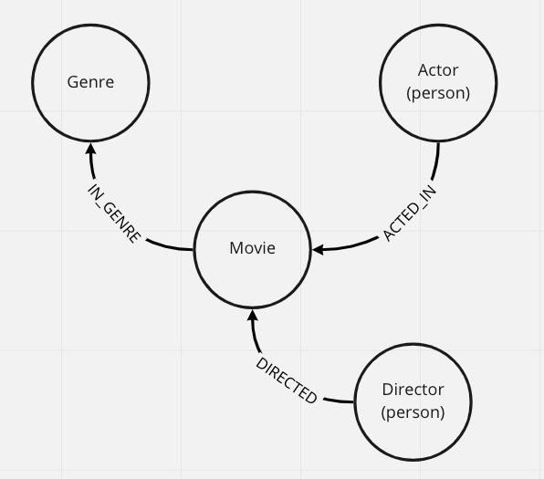
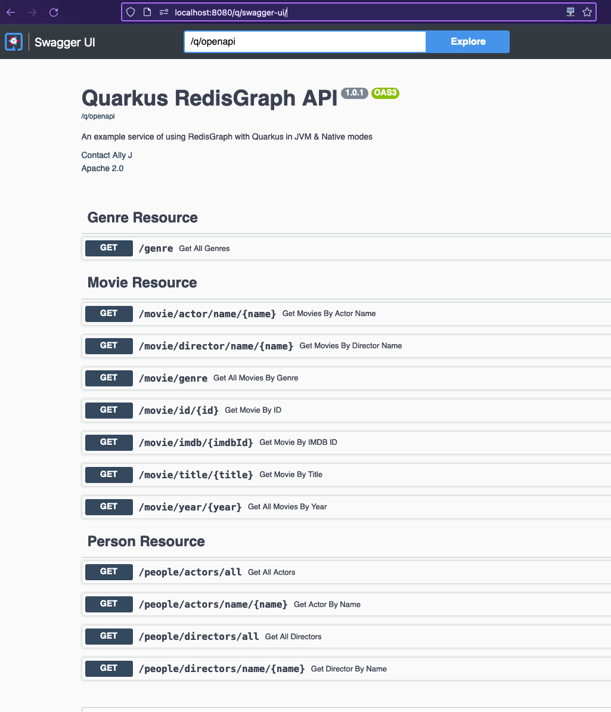

# Quarkus RedisGraph Jedis Project

## Versions

graalvm-ce-java11-22.0.0.2

## Intro

This project uses Quarkus, RedisGraph and Jedis.

- If you want to learn more about Quarkus, please visit its website: https://quarkus.io/ .
- If you want to learn more about RedisGraph, please visit its website: https://redis.io/docs/stack/graph/ 
- If you want to learn more about Redis-Stack, please visit its website: https://redis.io/docs/stack/
- If you want to learn more about Jedis, please visit its website: https://github.com/redis/jedis

NOTE: Quarkus provides 2 operating modes
- JVM
- Native 

## Running the application in dev mode

You can run your application in dev mode that enables live coding using:
```shell script
./mvnw compile quarkus:dev
```

> **_NOTE:_**  Quarkus now ships with a Dev UI, which is available in dev mode only at http://localhost:8080/q/dev/.

## Packaging and running the application

The application can be packaged using:
```shell script
./mvnw package
```
It produces the `quarkus-run.jar` file in the `target/quarkus-app/` directory.
Be aware that it’s not an _über-jar_ as the dependencies are copied into the `target/quarkus-app/lib/` directory.

The application is now runnable using `java -jar target/quarkus-app/quarkus-run.jar`.

If you want to build an _über-jar_, execute the following command:
```shell script
./mvnw package -Dquarkus.package.type=uber-jar
```

The application, packaged as an _über-jar_, is now runnable using `java -jar target/*-runner.jar`.

## Redis Graph Schema
Redis Graph exists as a single key within redis.
This demo application uses a simple graph schema for storing its Movie based data & Relationships


*Redis Graph Schema*

## Build & Run

### Creating a native executable

You can create a native executable using: 
```shell script
./mvnw package -Pnative
```

Or, if you don't have GraalVM installed, you can run the native executable build in a container using: 
```shell script
./mvnw package -Pnative -Dquarkus.native.container-build=true
```

You can then execute your native executable with: `./target/jedis-test-1.0.0-SNAPSHOT-runner`

If you want to learn more about building native executables, please consult https://quarkus.io/guides/maven-tooling.

### Provided Code

#### Running this example

1. Start Docker (Redis Stack)

If you dont have the redis-stack image locally:
```shell script
docker pull redis/redis-stack:latest
docker run -d --name redis-stack -p 6379:6379 -p 8001:8001 redis/redis-stack:latest

docker container ls
CONTAINER ID   IMAGE                      COMMAND            CREATED          STATUS          PORTS                                            NAMES
e2bc9a81477b   redis/redis-stack:latest   "/entrypoint.sh"   25 seconds ago   Up 25 seconds   0.0.0.0:6379->6379/tcp, 0.0.0.0:8001->8001/tcp   redis-stack
```
otherwise:
```bash
docker start redis-stack
```
**NOTE**: Redis Insights is available OOTB with Redis-Stack @ `http://localhost:8001`

**TIP**: To view all the commands being sent to Redis, you can use the `Monitor` command
```bash
$ redis-cli -h localhost -p 6379
localhost:6379> monitor
OK
```

2. Build and run the native image (Option 1)

If you want to run as a native image the use the `-Pnative` profile: 
```shell script
./mvnw package -Pnative

# Execute the compiled binary: 
$ ./target/quarkus-jedis-graph-1.0.0-SNAPSHOT-runner
```

3. Alternatively run in JVM Mode (Option 2)
If you want to run in standard JVM mode then:
```shell script
./mvnw clean quarkus:dev -DskipTests
```

2Run the app
Running the one of the options above (Native or JVM Mode) will startup Quarkus. 
By default quarkus will delete and reinstall the local data set in `data/*.json`

**NOTE**: to disable/enable data loading :: `-Dredis.bulk.load.data=<true|false>` 

```shell script
$ ./target/quarkus-jedis-graph-1.0.0-SNAPSHOT-runner 
__  ____  __  _____   ___  __ ____  ______ 
 --/ __ \/ / / / _ | / _ \/ //_/ / / / __/ 
 -/ /_/ / /_/ / __ |/ , _/ ,< / /_/ /\ \   
--\___\_\____/_/ |_/_/|_/_/|_|\____/___/   
2022-06-17 10:39:55,020 INFO  [io.qua.sma.ope.run.OpenApiRecorder] (main) Default CORS properties will be used, please use 'quarkus.http.cors' properties instead
2022-06-17 10:39:55,024 INFO  [org.acm.red.con.JedisConfig] (main) Clearing down graph: redis-movies
2022-06-17 10:39:55,032 INFO  [org.acm.red.con.JedisConfig] (main) Successfully deleted redis-movies
2022-06-17 10:39:55,032 INFO  [org.acm.red.con.JedisConfig] (main) Hydrating graph with fresh values: redis-movies
2022-06-17 10:39:55,034 INFO  [org.acm.red.con.JedisConfig] (main) Serialised 51 movies from resources
2022-06-17 10:39:55,138 INFO  [org.acm.red.con.JedisConfig] (main) Serialised 20 genres from resources
2022-06-17 10:39:55,198 INFO  [org.acm.red.con.JedisConfig] (main) Serialised 192 Actor from resources
2022-06-17 10:39:55,557 INFO  [org.acm.red.con.JedisConfig] (main) Serialised 54 Director from resources
....
// ... lots of graph query strings ....
....
```

##### OpenAPI Definition : http://localhost:8080/q/swagger
##### Swagger UI : http://localhost:8080/q/swagger-ui/


*Redis Graph Schema*

5. Example Requests 
```shell script
// Get all Movies Directed by 'David Fincher'
$ curl GET 'http://localhost:8080/movie/director/name/David Fincher?page=1&limit=10'
{
    "total": 1,
    "page": 1,
    "totalPage": 0,
    "limit": 10,
    "items": [
        {
            "id": 807,
            "title": "Seven (a.k.a. Se7en)",
            "year": 1995,
            "imdbId": "0114369",
            "runtime": 127,
            "duration": 127,
            "imdbRating": 8.6,
            "movieId": 807,
            "languages": [
                "English"
            ],
            "countries": [
                "USA"
            ],
            "revenue": 327311859,
            "budget": 33000000,
            "tmdbId": 0,
            "imdbVotes": 981458,
            "released": "1995-09-22",
            "plot": "Two detectives, a rookie and a veteran, hunt a serial killer who uses the seven deadly sins as his modus operandi.",
            "tagline": "Two detectives, a rookie and a veteran, hunt a serial killer who uses the seven deadly sins as his modus operandi.",
            "url": "https://themoviedb.org/movie/807",
            "poster_image": "https://image.tmdb.org/t/p/w440_and_h660_face/6yoghtyTpznpBik8EngEmJskVUO.jpg",
            "poster": "https://image.tmdb.org/t/p/w440_and_h660_face/6yoghtyTpznpBik8EngEmJskVUO.jpg",
            "releaseDate": "1995-09-22"
        }
    ]
}

// Get all Movies Acted in by 'Tom Hanks'
$  curl GET 'http://localhost:8080/movie/actor/name/Tom Hanks?page=1&limit=10'
{
    "total": 2,
    "page": 1,
    "totalPage": 0,
    "limit": 10,
    "items": [
        {
            "id": 862,
            "title": "Toy Story",
            "year": 1995,
            "imdbId": "0114709",
            "runtime": 81,
            "duration": 81,
            "imdbRating": 8.3,
            "movieId": 862,
            "languages": [
                "English"
            ],
            "countries": [
                "USA"
            ],
            "revenue": 373554033,
            "budget": 30000000,
            "tmdbId": 0,
            "imdbVotes": 591836,
            "released": "1995-11-22",
            "plot": "A cowboy doll is profoundly threatened and jealous when a new spaceman figure supplants him as top toy in a boy's room.",
            "tagline": "A cowboy doll is profoundly threatened and jealous when a new spaceman figure supplants him as top toy in a boy's room.",
            "url": "https://themoviedb.org/movie/862",
            "poster_image": "https://image.tmdb.org/t/p/w440_and_h660_face/uXDfjJbdP4ijW5hWSBrPrlKpxab.jpg",
            "poster": "https://image.tmdb.org/t/p/w440_and_h660_face/uXDfjJbdP4ijW5hWSBrPrlKpxab.jpg",
            "releaseDate": "1995-11-22"
        },
        {
            "id": 8844192,
            "title": "Forrest Gump",
            "year": 1994,
            "imdbId": "8844192",
            "runtime": 142,
            "duration": 104,
            "imdbRating": 8.8,
            "movieId": 8844192,
            "languages": [
                "English"
            ],
            "countries": [
                "USA"
            ],
            "revenue": 677387716,
            "budget": 65000000,
            "tmdbId": 0,
            "imdbVotes": 1835137,
            "released": "1994-07-06",
            "plot": "A man with a low IQ has accomplished great things in his life and been present during significant historic events—in each case, far exceeding what anyone imagined he could do. But despite all he has achieved, his one true love eludes him.",
            "tagline": "Life is like a box of chocolates...you never know what you're gonna get",
            "url": "https://www.themoviedb.org/movie/13-forrest-gump",
            "poster_image": "https://image.tmdb.org/t/p/w440_and_h660_face/vgpXmVaVyUL7GGiDeiK1mKEKzcX.jpg",
            "poster": "https://www.themoviedb.org/t/p/w1280/h5J4W4veyxMXDMjeNxZI46TsHOb.jpg",
            "releaseDate": "1994-07-06"
        }
    ]
}

// Get all Genres 
$  curl GET 'http://localhost:8080/genre'
[
    "Adventure",
    "Animation",
    "Children",
    "Comedy",
    "Fantasy",
    "Romance",
    "Drama",
    "Action",
    "Crime",
    "Thriller",
    "Horror",
    "Mystery",
    "Sci-Fi",
    "Documentary",
    "IMAX",
    "War",
    "Musical",
    "Western",
    "Film-Noir",
    "Unknown"
]

// Get all Movies Acted in Genres 'Sci-Fi','Animation'
$ curl GET  'http://localhost:8080/movie/genre?page=1&limit=30&genres=Sci-Fi,Animation'
{
    "total": 6,
    "page": 1,
    "totalPage": 0,
    "limit": 30,
    "items": [
        {
            "id": 862,
            "title": "Toy Story",
            "year": 1995,
            "imdbId": "0114709",
            "runtime": 81,
            "duration": 81,
            "imdbRating": 8.3,
            "movieId": 862,
            "languages": [
                "English"
            ],
            "countries": [
                "USA"
            ],
            "revenue": 373554033,
            "budget": 30000000,
            "tmdbId": 0,
            "imdbVotes": 591836,
            "released": "1995-11-22",
            "plot": "A cowboy doll is profoundly threatened and jealous when a new spaceman figure supplants him as top toy in a boy's room.",
            "tagline": "A cowboy doll is profoundly threatened and jealous when a new spaceman figure supplants him as top toy in a boy's room.",
            "url": "https://themoviedb.org/movie/862",
            "poster_image": "https://image.tmdb.org/t/p/w440_and_h660_face/uXDfjJbdP4ijW5hWSBrPrlKpxab.jpg",
            "poster": "https://image.tmdb.org/t/p/w440_and_h660_face/uXDfjJbdP4ijW5hWSBrPrlKpxab.jpg",
            "releaseDate": "1995-11-22"
        },
        {
            "id": 21032,
            "title": "Balto",
            "year": 1995,
            "imdbId": "0112453",
            "runtime": 78,
            "duration": 78,
            "imdbRating": 7.1,
            "movieId": 21032,
            "languages": [
                "English"
            ],
            "countries": [
                "USA"
            ],
            "revenue": 11348324,
            "budget": 0,
            "tmdbId": 0,
            "imdbVotes": 29277,
            "released": "1995-12-22",
            "plot": "An outcast half-wolf risks his life to prevent a deadly epidemic from ravaging Nome, Alaska.",
            "tagline": "An outcast half-wolf risks his life to prevent a deadly epidemic from ravaging Nome, Alaska.",
            "url": "https://themoviedb.org/movie/21032",
            "poster_image": "https://image.tmdb.org/t/p/w440_and_h660_face/tpoaKJMRjOZl9cbZRR2aiKikyRC.jpg",
            "poster": "https://image.tmdb.org/t/p/w440_and_h660_face/tpoaKJMRjOZl9cbZRR2aiKikyRC.jpg",
            "releaseDate": "1995-12-22"
        },
        {
            "id": 10530,
            "title": "Pocahontas",
            "year": 1995,
            "imdbId": "0114148",
            "runtime": 81,
            "duration": 81,
            "imdbRating": 6.6,
            "movieId": 10530,
            "languages": [
                "English",
                " Algonquin"
            ],
            "countries": [
                "USA"
            ],
            "revenue": 346079773,
            "budget": 55000000,
            "tmdbId": 0,
            "imdbVotes": 113939,
            "released": "1995-06-23",
            "plot": "An English soldier and the daughter of an Algonquin chief share a romance when English colonists invade seventeenth-century Virginia.",
            "tagline": "An English soldier and the daughter of an Algonquin chief share a romance when English colonists invade seventeenth-century Virginia.",
            "url": "https://themoviedb.org/movie/10530",
            "poster_image": "https://image.tmdb.org/t/p/w440_and_h660_face/kZ1ft0QZ4e3zDUPMBftEkwI9ftd.jpg",
            "poster": "https://image.tmdb.org/t/p/w440_and_h660_face/kZ1ft0QZ4e3zDUPMBftEkwI9ftd.jpg",
            "releaseDate": "1995-06-23"
        },
        {
            "id": 12665,
            "title": "Powder",
            "year": 1995,
            "imdbId": "0114168",
            "runtime": 111,
            "duration": 111,
            "imdbRating": 6.5,
            "movieId": 12665,
            "languages": [
                "English"
            ],
            "countries": [
                "USA"
            ],
            "revenue": 0,
            "budget": 0,
            "tmdbId": 0,
            "imdbVotes": 23715,
            "released": "1995-10-27",
            "plot": "A young bald albino boy with unique powers shakes up the rural community he lives in.",
            "tagline": "A young bald albino boy with unique powers shakes up the rural community he lives in.",
            "url": "https://themoviedb.org/movie/12665",
            "poster_image": "https://image.tmdb.org/t/p/w440_and_h660_face/kImKATjY4EsK5MDgrmpJdGbQEbq.jpg",
            "poster": "https://image.tmdb.org/t/p/w440_and_h660_face/kImKATjY4EsK5MDgrmpJdGbQEbq.jpg",
            "releaseDate": "1995-10-27"
        },
        {
            "id": 902,
            "title": "City of Lost Children, The (Cité des enfants perdus, La)",
            "year": 1995,
            "imdbId": "0112682",
            "runtime": 112,
            "duration": 112,
            "imdbRating": 7.7,
            "movieId": 902,
            "languages": [
                "French",
                " Cantonese"
            ],
            "countries": [
                "France",
                " Germany",
                " Spain"
            ],
            "revenue": 1738611,
            "budget": 18000000,
            "tmdbId": 0,
            "imdbVotes": 54490,
            "released": "1995-12-15",
            "plot": "A scientist in a surrealist society kidnaps children to steal their dreams, hoping that they slow his aging process.",
            "tagline": "A scientist in a surrealist society kidnaps children to steal their dreams, hoping that they slow his aging process.",
            "url": "https://themoviedb.org/movie/902",
            "poster_image": "https://image.tmdb.org/t/p/w440_and_h660_face/xQrp6wxaNMXVd259235d1X0LBsw.jpg",
            "poster": "https://image.tmdb.org/t/p/w440_and_h660_face/xQrp6wxaNMXVd259235d1X0LBsw.jpg",
            "releaseDate": "1995-12-15"
        },
        {
            "id": 63,
            "title": "Twelve Monkeys (a.k.a. 12 Monkeys)",
            "year": 1995,
            "imdbId": "0114746",
            "runtime": 129,
            "duration": 129,
            "imdbRating": 8.1,
            "movieId": 63,
            "languages": [
                "English",
                " French"
            ],
            "countries": [
                "USA"
            ],
            "revenue": 168840000,
            "budget": 29500000,
            "tmdbId": 0,
            "imdbVotes": 446779,
            "released": "1996-01-05",
            "plot": "In a future world devastated by disease, a convict is sent back in time to gather information about the man-made virus that wiped out most of the human population on the planet.",
            "tagline": "In a future world devastated by disease, a convict is sent back in time to gather information about the man-made virus that wiped out most of the human population on the planet.",
            "url": "https://themoviedb.org/movie/63",
            "poster_image": "https://image.tmdb.org/t/p/w440_and_h660_face/kKoG0hXBmBbkDnJYhhHisdin73W.jpg",
            "poster": "https://image.tmdb.org/t/p/w440_and_h660_face/kKoG0hXBmBbkDnJYhhHisdin73W.jpg",
            "releaseDate": "1996-01-05"
        }
    ]
}
```


