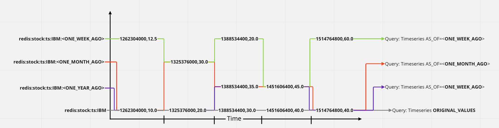
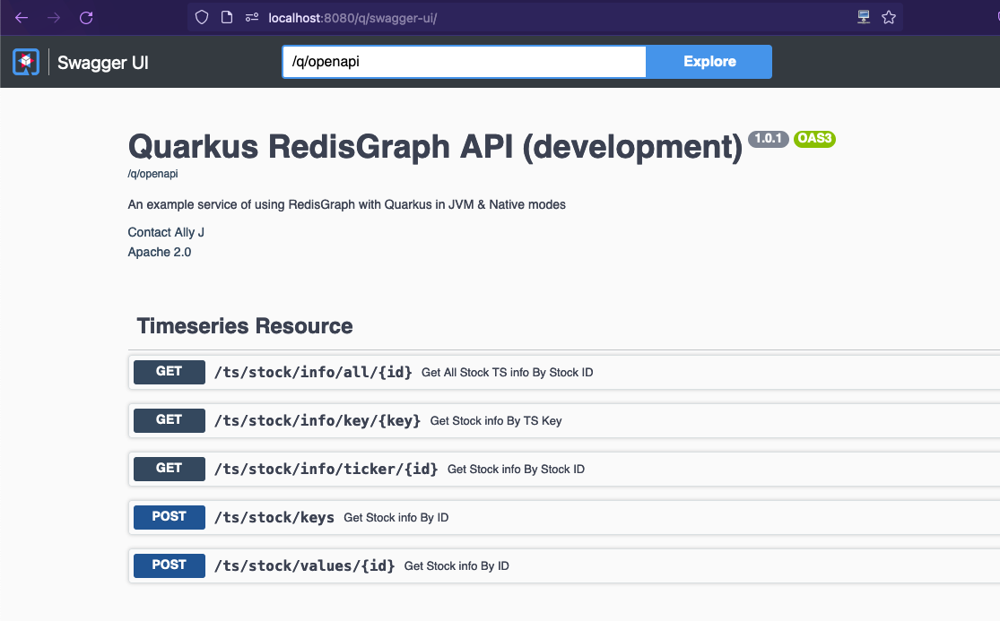

# Quarkus Redis Timeseries Jedis Project

## Intro

This project uses Quarkus, Redis TimeSeries and Jedis.

- If you want to learn more about Quarkus, please visit its website: https://quarkus.io/ .
- If you want to learn more about RedisTimeSeries, please visit its website: https://redis.io/docs/stack/timeseries/ 
- If you want to learn more about Redis-Stack, please visit its website: https://redis.io/docs/stack/
- If you want to learn more about Jedis, please visit its website: https://github.com/redis/jedis

NOTE: Quarkus provides 2 operating modes
- JVM (runs as a normal JAR file via the machines installed JMV)
- Native (compiled into a native image and executed as a machine process)


## Dataset

Data for this demo has been derived from the [Kaggle - Daily Historical Stock Prices (1970 - 2018)](https://www.kaggle.com/datasets/ehallmar/daily-historical-stock-prices-1970-2018?resource=download)
There is currently 4 csv files that are used to pre-load the dataset: 

- **nasdaq_top_250.csv** 
  - Used to derive the top 250 stock accounts which are focus within this demo. These top 250 accounts have been extracted from the kaggle data set to reduce its original size (2gb) 
- **ibm_stock_prices.csv**
  - A collection of IBM Stock prices from the Kaggle Data-Set
- **ibm_stock_prices_adjusted.csv**
  - A collection of adjusted IBM Stock prices to demo multi-dimension TS queries
- **stock_prices_1970_2018.csv**
  - A collection of stock prices from 1970-2018 of the top 250 accounts

Extraction was done using the `extract_top_250.py` python script

---
**NOTE**: To run the Python script you will need to download the Kaggle dataset and name it `historical_stock_prices.csv`

---

## Running the application in dev mode

You can run your application in dev mode that enables live coding using:
```shell script
./mvnw compile quarkus:dev
```

> **_NOTE:_**  Quarkus now ships with a Dev UI, which is available in dev mode only at http://localhost:8080/q/dev/.

## Packaging and running the application

The application can be packaged using:
```shell script
./mvnw package
```
It produces the `quarkus-run.jar` file in the `target/quarkus-app/` directory.
Be aware that it’s not an _über-jar_ as the dependencies are copied into the `target/quarkus-app/lib/` directory.

The application is now runnable using `java -jar target/quarkus-app/quarkus-run.jar`.

If you want to build an _über-jar_, execute the following command:
```shell script
./mvnw package -Dquarkus.package.type=uber-jar
```

The application, packaged as an _über-jar_, is now runnable using `java -jar target/*-runner.jar`.

## Redis TimeSeries Demo

This application provides a number of implementation examples on how to use Redis TimeSeries in a Java app.\
Most importantly this app provides an example of 'multi-dimensional' TimeSeries that is queryable from a specific date. 

Currently the ability to query in a multi-dimensional fashion in Redis Timeseries is not available OOTB.\
However using the current data model structures we can still query pretty efficiently across the TimeSeries and aggregate at the client level.

For example consider the following TimeSeries of IBM stock CoB numbers: 
- `redis:stock:ts:IBM=[(1655991500,10.0), (1655991600,20.0), (1655991700,30.0), (1655991800,40.0), (1655991900,50.0)]`
  - `Labels=['STOCK=IBM', 'STOCK_TICKER_TYPE=COB', KEY='redis:stock:ts:IBM']`

---
**NOTE:** Every TimeSeries in Redis has an associated list of ***Labels*** which are a simple Key/Value pair of strings, used as identifiers.

----

This timeseries provides us with stock price for IBM for the given timestamp.\
However what if we wanted to create a third dimension to this series?\
What if we wanted to retrospectively change the values because the originals were inaccurate? 

How could we query accross these multiple timeseries?\
How can we model this?  

This demo has attempted to solve this problem using the following data structure: 
- The TimeSeries (Key/[(Values)]): `redis:stock:ts:IBM:<ADJUSTMENT_DATE>=[(1655991500,12.5), (1655991700,20.0), (1655991900,60.0)]`
  - Label[]`['STOCK=IBM', 'STOCK_TICKER_TYPE=COB', KEY='redis:stock:ts:IBM:<TODAYS_DATE>', 'ADJUSTMENT_DATE=<TODAYS_DATE>']`
  - Each 'adjustment' collection of TS's will form a new timeseries with a key that appends the adjustment date: `redis:stock:ts:IBM:<ADJUSTMENT_DATE>`
  - Each new TS will include the label 'ADJUSTMENT_DATE' to indicate the timestamp of when it was updated and identify it as an adjusted TS.

Using the current Redis TimeSeries query capabilities, we can then query in a multi-dimensional fashion in 2 over the wire queries:
- `TS.QUERYINDEX Labels[]`
  - Returns a list of TS Keys with the associated labels, due to the appended timestamp on the keys these can then be filtered within the client in accordance to the `QUERY_FROM/AS_OF` date
- `TS.MRANGE fromTimeStamp toTimestamp FILTER Labels[]`
  - Returns a ranged list of TS Values for each TS Key, which are merged/flattened within the client 

For Example, take the following TimeSeries
- `redis:stock:ts:IBM=[(1262304000,10.0), (1325376000,20.0), (1388534400,30.0), (1451606400,40.0), (1514764800,50.0)]`
    - `Labels=['STOCK=IBM', 'STOCK_TICKER_TYPE=COB', KEY='redis:stock:ts:IBM']`
- `redis:stock:ts:IBM:<ONE_YEAR_AGO>=[(1388534400,35.0), (1451606400,45.0)]`
    - `Labels=['STOCK=IBM', 'STOCK_TICKER_TYPE=COB', KEY='redis:stock:ts:IBM', 'ADJUSTMENT_DATE=<ONE_YEAR_AGO>']`
- `redis:stock:ts:IBM:<ONE_MONTH_AGO>=[(1325376000,30.0)]`
    - `Labels=['STOCK=IBM', 'STOCK_TICKER_TYPE=COB', KEY='redis:stock:ts:IBM',  'ADJUSTMENT_DATE=<ONE_MONTH_AGO>']`
- `redis:stock:ts:IBM:<ONE_WEEK_AGO>=[(1262304000,12.5), (1388534400,20.0), (1514764800,60.0)]`
    - `Labels=['STOCK=IBM', 'STOCK_TICKER_TYPE=COB', KEY='redis:stock:ts:IBM', 'ADJUSTMENT_DATE=<ONE_WEEK_AGO>']`
    
**NOTE:**
- 1262304000 = 2010-01-01
- 1325376000 = 2012-01-01
- 1388534400 = 2014-01-01
- 1451606400 = 2016-01-01
- 1514764800 = 2018-01-01

I can expect to receive the existing TS e.g. 

- GET The Original IBM TimeSeries for a given range: 
  - cURL Request:`curl --location --request POST 'http://localhost:8080/ts/stock/values/IBM?fromDate=2010-01-01&toDate=2018-01-01' --header 'Content-Type: application/json' --data-raw '["STOCK=IBM"]'`
  - Return TS Result: `[(1262304000,10.0), (1325376000,20.0), (1388534400,30.0), (1451606400,40.0), (1514764800,50.0)]`

- GET The IBM TimeSeries for a given range from <ONE_YEAR_AGO>:
    - cURL Request:`curl --location --request POST 'http://localhost:8080/ts/stock/values/IBM?fromDate=2010-01-01&toDate=2018-01-01&asOfDate=<ONE_YEAR_AGO>' --header 'Content-Type: application/json' --data-raw '["STOCK=IBM"]'`
    - Return TS Result: `[(1262304000,10.0), (1325376000,20.0), (1388534400,35.0), (1451606400,45.0), (1514764800,50.0)]`

- GET The IBM TimeSeries for a given range from <ONE_MONTH_AGO>:
    - cURL Request:`curl --location --request POST 'http://localhost:8080/ts/stock/values/IBM?fromDate=2010-01-01&toDate=2018-01-01&asOfDate=<ONE_MONTH_AGO>' --header 'Content-Type: application/json' --data-raw '["STOCK=IBM"]'`
    - Return TS Result: `[(1262304000,10.0), (1325376000,30.0), (1388534400,35.0), (1451606400,45.0), (1514764800,50.0)]`

- GET The IBM TimeSeries for a given range from <ONE_WEEK_AGO>:
    - cURL Request:`curl --location --request POST 'http://localhost:8080/ts/stock/values/IBM?fromDate=2010-01-01&toDate=2018-01-01&asOfDate=<ONE_WEEK_AGO>' --header 'Content-Type: application/json' --data-raw '["STOCK=IBM"]'`
    - Return TS Result: `[(1262304000,12.5), (1325376000,30.0), (1388534400,20.0), (1451606400,45.0), (1514764800,40.0)]`

Or for a more visual representation: 


*TimeSeries Multi-Dimension Querying Visualised*


### Caveats 

Please note there are some caveats to the multi-dimensional query approach, namely the ability to use the aggregation capabilities since the interpolation of the data set occurs at the client level.


## Build & Run

### Creating a native executable

You can create a native executable using: 
```shell script
./mvnw package -Pnative
```

Or, if you don't have GraalVM installed, you can run the native executable build in a container using: 
```shell script
./mvnw package -Pnative -Dquarkus.native.container-build=true
```

You can then execute your native executable with: `./target/jedis-test-1.0.0-SNAPSHOT-runner`

If you want to learn more about building native executables, please consult https://quarkus.io/guides/maven-tooling.

### Provided Code

#### Running this example

1. Start Docker (Redis Stack)

If you dont have the redis-stack image locally:
```shell script
docker pull redis/redis-stack:latest
docker run -d --name redis-stack -p 6379:6379 -p 8001:8001 redis/redis-stack:latest

docker container ls
CONTAINER ID   IMAGE                      COMMAND            CREATED          STATUS          PORTS                                            NAMES
e2bc9a81477b   redis/redis-stack:latest   "/entrypoint.sh"   25 seconds ago   Up 25 seconds   0.0.0.0:6379->6379/tcp, 0.0.0.0:8001->8001/tcp   redis-stack
```
otherwise:
```bash
docker start redis-stack
```
**NOTE**: Redis Insights is available OOTB with Redis-Stack @ `http://localhost:8001`

**TIP**: To view all the commands being sent to Redis, you can use the `Monitor` command
```bash
$ redis-cli -h localhost -p 6379
localhost:6379> monitor
OK
```

2. Build and run the native image (Option 1)

If you want to run as a native image the use the `-Pnative` profile: 
```shell script
./mvnw package -Pnative

# Execute the compiled binary: 
$ ./target/quarkus-jedis-graph-1.0.0-SNAPSHOT-runner
```

3. Alternatively run in JVM Mode (Option 2)
If you want to run in standard JVM mode then:
```shell script
./mvnw clean quarkus:dev -DskipTests
```

4. Run the app
Running the one of the options above (Native or JVM Mode) will startup Quarkus. 
By default quarkus will delete and reinstall the local data set in `data/*.json`

**NOTE**: to disable/enable data loading :: `-Dredis.bulk.load.data=<true|false>` 

```shell script
$ ./target/quarkus-jedis-graph-1.0.0-SNAPSHOT-runner 
__  ____  __  _____   ___  __ ____  ______ 
 --/ __ \/ / / / _ | / _ \/ //_/ / / / __/ 
 -/ /_/ / /_/ / __ |/ , _/ ,< / /_/ /\ \   
--\___\_\____/_/ |_/_/|_/_/|_|\____/___/   
2022-06-17 10:39:55,020 INFO  [io.qua.sma.ope.run.OpenApiRecorder] (main) Default CORS properties will be used, please use 'quarkus.http.cors' properties instead
2022-06-17 10:39:55,024 INFO  [org.acm.red.con.JedisConfig] (main) Clearing down graph: redis-movies
2022-06-17 10:39:55,032 INFO  [org.acm.red.con.JedisConfig] (main) Successfully deleted redis-movies
2022-06-17 10:39:55,032 INFO  [org.acm.red.con.JedisConfig] (main) Hydrating graph with fresh values: redis-movies
2022-06-17 10:39:55,034 INFO  [org.acm.red.con.JedisConfig] (main) Serialised 51 movies from resources
2022-06-17 10:39:55,138 INFO  [org.acm.red.con.JedisConfig] (main) Serialised 20 genres from resources
2022-06-17 10:39:55,198 INFO  [org.acm.red.con.JedisConfig] (main) Serialised 192 Actor from resources
2022-06-17 10:39:55,557 INFO  [org.acm.red.con.JedisConfig] (main) Serialised 54 Director from resources
....
// ... lots of graph query strings ....
....
```

##### OpenAPI Definition : http://localhost:8080/q/swagger
##### Swagger UI : http://localhost:8080/q/swagger-ui/


*Redis Graph Schema*

5. Example Requests 
```shell script
// POST all IBM COB Stock prices between 2010-01-01 - 2018-01-01 with an adjustment date of 2014-05-01
$ curl POST 'http://localhost:8080/ts/stock/values/IBM?asOfDate=2014-05-01&fromDate=2010-01-01&toDate=2018-01-01' \
--header 'Content-Type: application/json' \
--data-raw '["STOCK=IBM"]'
{
    "key": "redis:stock:ts:IBM",
    "tsSize": 2013,
    "fromDate": "2010-01-01",
    "fromDateUTC": 1262304000000,
    "toDate": "2018-01-01",
    "toDateUTC": 1514764800000,
    "asOfDate": "2014-05-01",
    "asOfDateUTC": 1398898800000,
    "adjustedKeys": [
        "redis:stock:ts:IBM:1335222000000",
        "redis:stock:ts:IBM:1398294000000"
    ],
    "labels": {
        "STOCK": "IBM",
        "KEY": "redis:stock:ts:IBM"
    },
    "values": {
        "1340578800000": 192.860000610352,
        "1397689200000": 190.009994506836,
        "1487289600000": 180.669998168945,
        "1283468400000": 127.580001831055,
        ....
        }
}

// POST Return All Keys involved in an Multi-Dimensional 'AS_OF' query
 curl POST 'http://localhost:8080/ts/stock/keys?date=2020-01-01' \
--header 'Content-Type: application/json' \
--data-raw '["STOCK=IBM"]'
[
    "redis:stock:ts:IBM",
    "redis:stock:ts:IBM:1335222000000",
    "redis:stock:ts:IBM:1398294000000",
    "redis:stock:ts:IBM:1556060400000",
    "redis:stock:ts:IBM:1461452400000",
    "redis:stock:ts:IBM:1492988400000",
    "redis:stock:ts:IBM:1524524400000"
]

// Get TimeSeries Info by Ticker ID 
$  curl GET 'http://localhost:8080/ts/stock/info/ticker/IBM'
{
    "properties": {
        "firstTimestamp": 82800000,
        "memoryUsage": 71065,
        "chunkSize": 4096,
        "lastTimestamp": 1535065200000,
        "chunkCount": 17,
        "totalSamples": 12271,
        "retentionTime": 0,
        "chunkType": "Y29tcHJlc3NlZA==",
        "labels": {
            "STOCK": "IBM",
            "KEY": "redis:stock:ts:IBM"
        }
    },
    "labels": {
        "STOCK": "IBM",
        "KEY": "redis:stock:ts:IBM"
    }
}

// Get TimeSeries Info by TimeSeries Key
$  curl GET 'http://localhost:8080/ts/stock/info/key/redis:stock:ts:IBM:1524524400000'
{
    "properties": {
        "firstTimestamp": 1452211200000,
        "memoryUsage": 4302,
        "chunkSize": 4096,
        "lastTimestamp": 1527030000000,
        "chunkCount": 1,
        "totalSamples": 4,
        "retentionTime": 0,
        "chunkType": "Y29tcHJlc3NlZA==",
        "labels": {
            "ADJUSTED": "1524524400000",
            "STOCK": "IBM",
            "KEY": "redis:stock:ts:IBM:1524524400000"
        }
    },
    "labels": {
        "ADJUSTED": "1524524400000",
        "STOCK": "IBM",
        "KEY": "redis:stock:ts:IBM:1524524400000"
    }
}

// Get ALL TimeSeries Info by Ticker ID
$  curl GET 'http://localhost:8080/ts/stock/info/all/IBM'
[
    {
        "properties": {
            "firstTimestamp": 82800000,
            "memoryUsage": 71065,
            "chunkSize": 4096,
            "lastTimestamp": 1535065200000,
            "chunkCount": 17,
            "totalSamples": 12271,
            "retentionTime": 0,
            "chunkType": "Y29tcHJlc3NlZA==",
            "labels": {
                "STOCK": "IBM",
                "KEY": "redis:stock:ts:IBM"
            }
        },
        "labels": {
            "STOCK": "IBM",
            "KEY": "redis:stock:ts:IBM"
        }
    },
    {
        "properties": {
            "firstTimestamp": 1169424000000,
            "memoryUsage": 4302,
            "chunkSize": 4096,
            "lastTimestamp": 1265673600000,
            "chunkCount": 1,
            "totalSamples": 8,
            "retentionTime": 0,
            "chunkType": "Y29tcHJlc3NlZA==",
            "labels": {
                "ADJUSTED": "1335222000000",
                "STOCK": "IBM",
                "KEY": "redis:stock:ts:IBM:1335222000000"
            }
        },
        "labels": {
            "ADJUSTED": "1335222000000",
            "STOCK": "IBM",
            "KEY": "redis:stock:ts:IBM:1335222000000"
        }
    },
    {
        "properties": {
            "firstTimestamp": 1169769600000,
            "memoryUsage": 4302,
            "chunkSize": 4096,
            "lastTimestamp": 1341270000000,
            "chunkCount": 1,
            "totalSamples": 13,
            "retentionTime": 0,
            "chunkType": "Y29tcHJlc3NlZA==",
            "labels": {
                "ADJUSTED": "1398294000000",
                "STOCK": "IBM",
                "KEY": "redis:stock:ts:IBM:1398294000000"
            }
        },
        "labels": {
            "ADJUSTED": "1398294000000",
            "STOCK": "IBM",
            "KEY": "redis:stock:ts:IBM:1398294000000"
        }
    },
    {
        "properties": {
            "firstTimestamp": 1341442800000,
            "memoryUsage": 4302,
            "chunkSize": 4096,
            "lastTimestamp": 1451520000000,
            "chunkCount": 1,
            "totalSamples": 4,
            "retentionTime": 0,
            "chunkType": "Y29tcHJlc3NlZA==",
            "labels": {
                "ADJUSTED": "1461452400000",
                "STOCK": "IBM",
                "KEY": "redis:stock:ts:IBM:1461452400000"
            }
        },
        "labels": {
            "ADJUSTED": "1461452400000",
            "STOCK": "IBM",
            "KEY": "redis:stock:ts:IBM:1461452400000"
        }
    },
    {
        "properties": {
            "firstTimestamp": 1451865600000,
            "memoryUsage": 4302,
            "chunkSize": 4096,
            "lastTimestamp": 1452124800000,
            "chunkCount": 1,
            "totalSamples": 4,
            "retentionTime": 0,
            "chunkType": "Y29tcHJlc3NlZA==",
            "labels": {
                "ADJUSTED": "1492988400000",
                "STOCK": "IBM",
                "KEY": "redis:stock:ts:IBM:1492988400000"
            }
        },
        "labels": {
            "ADJUSTED": "1492988400000",
            "STOCK": "IBM",
            "KEY": "redis:stock:ts:IBM:1492988400000"
        }
    },
    {
        "properties": {
            "firstTimestamp": 1452211200000,
            "memoryUsage": 4302,
            "chunkSize": 4096,
            "lastTimestamp": 1527030000000,
            "chunkCount": 1,
            "totalSamples": 4,
            "retentionTime": 0,
            "chunkType": "Y29tcHJlc3NlZA==",
            "labels": {
                "ADJUSTED": "1524524400000",
                "STOCK": "IBM",
                "KEY": "redis:stock:ts:IBM:1524524400000"
            }
        },
        "labels": {
            "ADJUSTED": "1524524400000",
            "STOCK": "IBM",
            "KEY": "redis:stock:ts:IBM:1524524400000"
        }
    },
    {
        "properties": {
            "firstTimestamp": 1527116400000,
            "memoryUsage": 4302,
            "chunkSize": 4096,
            "lastTimestamp": 1527634800000,
            "chunkCount": 1,
            "totalSamples": 4,
            "retentionTime": 0,
            "chunkType": "Y29tcHJlc3NlZA==",
            "labels": {
                "ADJUSTED": "1556060400000",
                "STOCK": "IBM",
                "KEY": "redis:stock:ts:IBM:1556060400000"
            }
        },
        "labels": {
            "ADJUSTED": "1556060400000",
            "STOCK": "IBM",
            "KEY": "redis:stock:ts:IBM:1556060400000"
        }
    },
    {
        "properties": {
            "firstTimestamp": 1527721200000,
            "memoryUsage": 4302,
            "chunkSize": 4096,
            "lastTimestamp": 1528153200000,
            "chunkCount": 1,
            "totalSamples": 4,
            "retentionTime": 0,
            "chunkType": "Y29tcHJlc3NlZA==",
            "labels": {
                "ADJUSTED": "1587682800000",
                "STOCK": "IBM",
                "KEY": "redis:stock:ts:IBM:1587682800000"
            }
        },
        "labels": {
            "ADJUSTED": "1587682800000",
            "STOCK": "IBM",
            "KEY": "redis:stock:ts:IBM:1587682800000"
        }
    },
    {
        "properties": {
            "firstTimestamp": 1528239600000,
            "memoryUsage": 4302,
            "chunkSize": 4096,
            "lastTimestamp": 1528239600000,
            "chunkCount": 1,
            "totalSamples": 1,
            "retentionTime": 0,
            "chunkType": "Y29tcHJlc3NlZA==",
            "labels": {
                "ADJUSTED": "1619218800000",
                "STOCK": "IBM",
                "KEY": "redis:stock:ts:IBM:1619218800000"
            }
        },
        "labels": {
            "ADJUSTED": "1619218800000",
            "STOCK": "IBM",
            "KEY": "redis:stock:ts:IBM:1619218800000"
        }
    }
]
```


